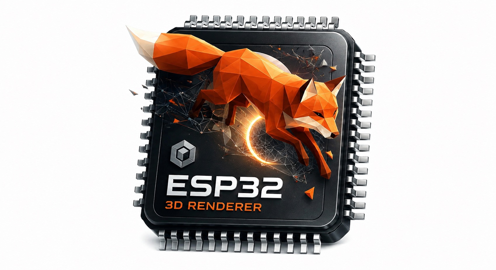

<p align="center">
  
</p>

<h1 align="center">a3d</h1>

<p align="center">
  <b>A 3D rendering and animation component for low-poly objects on microcontrollers.</b><br>
  Header-only, no third-party dependency, and measured on real hardware.
</p>

<p align="center">
  <a href="#why-this-exists">Why</a> ·
  <a href="#install">Install</a> ·
  <a href="#quickstart">Quickstart</a> ·
  <a href="#performance">Performance</a> ·
  <a href="#examples">Examples</a> ·
  <a href="#making-assets">Assets</a> ·
  <a href="#what-is-verified-and-what-is-not">What is verified</a>
</p>

---

## Why this exists

**A microcontroller has no GPU.** Every triangle here is set up, clipped,
binned and filled by the same core that runs your application, in software, one
pixel at a time. That is a slow way to draw a picture, and by any sensible
engineering measure putting a 3D renderer on an MCU is a poor use of the parts.

If you want 3D and you have a choice, you almost certainly want a cheap SBC
instead. A Raspberry Pi Zero 2 W costs about the same as a devkit, has a real
GPU and a real OS, and will run circles around anything in the tables below.
That is not a caveat buried at the bottom of this page; it is the honest first
thing to say.

**I built this anyway, because an animated low-poly character running on a
microcontroller is a delightful thing to have.** A little creature turning and
walking on a 240x320 panel, driven by a part that costs a few dollars and boots
in a second — that is the whole motivation. It is a toy in the good sense, and
this repository is an attempt to make it a well-measured, honestly documented
toy rather than a demo that works once.

So the goal here is not to compete with a GPU. It is to find out how far the
idea actually goes, and to say precisely where it stops:

- On an **ESP32-P4** an animated 4,672-triangle character runs at **55 fps** at
  240x320. There is real headroom.
- On an **ESP32-S3** the same model is **24 fps**. Usable, and the common case.
- On an **ESP32-C6** it is **1.7 fps**, because that part has no FPU and every
  float becomes a library call. It does not work, and the tables say so.

Every number on this page came off a board. Nothing is extrapolated, and where
something has not been measured it is marked as not measured.

---

## What this is

a3d draws animated low-poly 3D models and puts them on a panel. It is the whole
path, not a piece of one:

- **A binary asset container** (`.a3d`) built from a `.glb` on your desktop -
  quantised vertices, RGB565 textures, skeleton and animation clips - read in
  place from memory-mapped flash, so a model costs no RAM until it is drawn.
- **Skeletal animation.** Clips, channels, linear and step interpolation, up to
  255 bones, two weights a vertex.
- **A tile binner and a software rasterizer.** No GPU, no framebuffer: the
  screen is cut into horizontal strips and each is drawn into a small buffer
  and sent, so a 800x1280 panel does not need 2 MB of RAM.
- **A 2D canvas** with a 5x7 font, for the HUD over the top.
- **A four-call wrapper** (`a3d::Viewer`) that owns the slots, buffers,
  binners, camera and animation player, so a model on a screen is `begin`,
  `open`, `frame`.

It is **header-only** and depends on nothing but the C++17 standard library.

### Where it runs

**The core names no vendor API at all.** There is no `esp_lcd` call, no
FreeRTOS call and no vendor header in `include/`, in the rasterizer or in the
viewer: a panel is five function pointers, and threading is one interface you
implement with FreeRTOS, `std::thread`, or nothing. `a3d_board.h` detects the
part it is compiled for and falls back to a conservative single-core default on
anything it does not recognise, so an unknown target compiles and runs rather
than failing.

That makes it portable in principle to any target with a C++17 compiler and
enough RAM for one tile. Be careful with "in principle", though — this is what
has actually been done:

| | Status |
|---|---|
| ESP32-P4 / S3 / C6 | built, run and **measured** on hardware |
| Host (macOS, Linux) | full test suite on every change |
| Every other MCU | **never tried.** It should compile; nobody has confirmed it |

Only two files are ESP-specific, and both are opt-in loaders you include by
name: `a3d_load_esp_partition.h` and `a3d_load_sd.h`. Nothing else in the tree
would stop a Cortex-M port — but nothing in the tree proves one either, and
that is the difference this table exists to keep.

### What it is not

It is not a general 3D engine. There is no PBR, no shadow map, no post
processing, no scene graph beyond a node hierarchy, and the vertex ceiling is
65,535 per mesh. It is built for the case an MCU can actually run: a low-poly
character or object, animated, filling part of a small screen.

## Install

### ESP-IDF (component manager)

`main/idf_component.yml`:

```yaml
dependencies:
  a3d:
    git: "https://github.com/0015/a3d.git"
    version: "main"
```

Then name it in your component's `REQUIRES`:

```cmake
idf_component_register(SRCS "main.cpp" INCLUDE_DIRS "." REQUIRES a3d)
```

`idf.py build` fetches it. a3d is header-only and registers its own include
paths, so that is the whole integration. Pin a tag rather than a branch once
you care about reproducible builds.

### ESP-IDF (as a component in your tree)

```bash
mkdir -p components && git clone https://github.com/0015/a3d.git components/a3d
```

### Plain CMake, for host tests

```cmake
add_subdirectory(a3d)
target_link_libraries(app PRIVATE a3d_viewer)
```

`a3d_viewer` brings the core and the rasterizer with it. Link `a3d` alone for
the container reader and the scene runtime with no renderer.

### Arduino

a3d is a normal Arduino library. Put the whole repository - not just `src/` -
into your sketchbook's `libraries/` folder under the name `a3d`, then **restart
the IDE**: it reads the library index once at startup, so a library added while
it is open is not found and `#include <a3d.h>` fails.

The sketchbook is whatever *Preferences -> Sketchbook location* says, so:

```bash
git clone https://github.com/0015/a3d.git "<sketchbook>/libraries/a3d"
```

The folder must contain `library.properties` at its top level and the headers
in `src/`. Sketch -> Include Library -> a3d should then be listed, and:

```cpp
#include <a3d.h>
```

That one include brings the container reader, the scene runtime, the
rasterizer, the four-call viewer, the 2D canvas and - on ESP32 - the FreeRTOS
executor. The loaders and the larger fonts are deliberately left out of it, so
include those you want:

```cpp
#include <loaders/a3d_load_stl.h>
#include <backends/soft/a3d_font_12x21.h>
```

Or download the repository as a ZIP and use *Sketch -> Include Library -> Add
.ZIP Library*.

#### A whole sketch

a3d needs one thing from your display: a function that moves a rectangle of
RGB565 to it. Everything else has a default.

```cpp
#include <a3d.h>
#include "model_a3d.h"          // see "no EMBED_FILES" below

static a3d::Viewer  viewer;
static a3d::Display panel;
static a3d::FreeRtosExecutor executor(A3D_CONFIG_MAX_WORKERS);   // one per core

// Must not return until `src` may be reused: a3d owns one tile buffer per
// worker and overwrites it as soon as that worker takes the next tile.
static void sendTile(void*, const uint16_t* src, int x, int y, int w, int h)
    { gfx->draw16bitBeRGBBitmap(x, y, (uint16_t*)src, w, h); }   // your driver

static uint64_t nowUs(void*) { return (uint64_t)esp_timer_get_time(); }

void setup()
    {
    gfx->begin();                                   // your driver

    panel.width  = 466;
    panel.height = 466;
    panel.sendTile = sendTile;
    panel.swapBytes = true;      // true if your panel reads big-endian RGB565

    a3d::ViewerConfig cfg;
    cfg.tileHeight = 40;         // a3d renders one strip at a time

    viewer.setExecutor(executor);   // BEFORE begin(): it decides how many
    viewer.setClock(nowUs, nullptr); //                tile buffers to allocate

    if (!viewer.begin(panel, cfg)) { Serial.println(viewer.error()); return; }

    viewer.openAsset(model_a3d, model_a3d_len);
    viewer.frameModel();                 // fit the camera to the model
    if (viewer.clipCount()) { viewer.selectClip(0); viewer.setPlaying(true); }
    }

void loop()
    {
    viewer.frame(16.0f);         // dtMs: what advances the animation
    viewer.orbit(0.02f, 0.0f);
    }
```

`viewer.drag(dx, dy)` turns it from a touch controller, and
`viewer.setOverlay()` hands you each tile before it goes to the panel if you
want a caption on it.

**Getting the panel itself right is the step people stop at**, and it is
written out in full in [docs/DISPLAY_ARDUINO.md](docs/DISPLAY_ARDUINO.md):
which entry point of your display library to call and why one of them costs a
whole extra pass over the frame, the byte order that turns a black background
pink, the bus mutex two workers need, where the tile buffers have to live on a
board with PSRAM, and a symptom table.

#### Board settings that matter

| Tools menu | Why |
|---|---|
| **PSRAM** | Anything past a small model needs it. Without it `openAsset` fails on a container of a few hundred KB. |
| **Partition Scheme** | The model is compiled into the sketch, so pick a scheme with an app partition bigger than your model plus ~400 KB. |
| **USB CDC On Boot** | Enable it, or `Serial` output never appears and a failed `begin()` is silent. |

On a board with PSRAM the Arduino core sends every allocation above 4 KB to the
slow memory, tile framebuffers included. One line puts them back:

```cpp
static void* fastAlloc(size_t n)
    { return heap_caps_malloc(n, MALLOC_CAP_INTERNAL | MALLOC_CAP_DMA | MALLOC_CAP_8BIT); }
static void  fastFree(void* p) { heap_caps_free(p); }

viewer.setAllocator(fastAlloc, fastFree);     // before begin()
```

Two sketches come with it:

| Sketch | Board | What it shows |
|---|---|---|
| [Waveshare_ESP32-S3-Touch-AMOLED-1.75C](examples/Arduino/Waveshare_ESP32-S3-Touch-AMOLED-1.75C) | that board | Two animated models on real glass, from boot |
| [Model_From_Header](examples/Arduino/Model_From_Header) | any ESP32, no wiring | How to get a model onto a board with no `EMBED_FILES` |

The second renders off screen, so it uploads and runs on a board with nothing
attached to it.

**Arduino has no `EMBED_FILES`**, so a container reaches a sketch one of two
ways: as a byte array, or as a file.

```bash
python3 tools/a3d_export.py --header model.a3d -o model_a3d.h
```

```cpp
#include "model_a3d.h"
viewer.openAsset(model_a3d, model_a3d_len);       // or
viewer.openAssetFile("/sd/model.a3d");            // SD.begin() first
```

The generated array is 4-byte aligned and that is load-bearing: a3d casts the
base pointer straight to the file header, so an unaligned container is refused
on the board rather than at compile time.

**Arduino builds are slower than the tables below**, which were measured on
ESP-IDF. See [Arduino is not the fast path](#arduino-is-not-the-fast-path).

### PlatformIO

```ini
lib_deps = https://github.com/0015/a3d.git
```

Works under `framework = arduino` and `framework = espidf`. **Untested** - the
manifest names one include root for both, but nothing in this repository has
built a PlatformIO project.

---

## Quickstart

A model on a screen, in four calls. Everything else has a default.

```cpp
#include "viewer/a3d_viewer.h"
#include "backends/freertos/a3d_freertos_executor.h"

// Your panel: a size and one function that moves a rectangle of RGB565.
// It must not return until `src` may be reused - see THE ONE RULE below.
void sendTile(void*, const uint16_t* src, int x, int y, int w, int h)
    { my_panel_draw(x, y, w, h, src); }

extern const uint8_t model_start[] asm("_binary_model_a3d_start");
extern const uint8_t model_end[]   asm("_binary_model_a3d_end");

extern "C" void app_main(void)
    {
    a3d::Display panel;
    panel.width    = 240;
    panel.height   = 320;
    panel.sendTile = &sendTile;

    // Built BEFORE the viewer: it is what decides how many tile buffers exist.
    static a3d::FreeRtosExecutor exec(2, 8192, 5);

    static a3d::Viewer viewer;
    viewer.setExecutor(exec);
    viewer.begin(panel);                                    // 1
    viewer.openAsset(model_start, model_end - model_start); // 2

    while (true)
        {
        viewer.frame(16.0f);                                // 3
        vTaskDelay(pdMS_TO_TICKS(16));
        }
    }
```

`openStl()`, `openStlFile()`, `openFile()` and `openSphere()` are the other
sources. The camera frames the model on the first frame; `orbit()`, `zoom()`
and `setOrbit()` move it after that.

**THE ONE RULE.** `sendTile` must not return until the buffer may be reused.
The viewer owns one tile buffer per worker and hands it to the next tile
immediately, so a driver that queues the pointer and returns will send whatever
the next tile overwrote it with - half of one tile and half of the next, which
reads as a rasterizer bug. If your driver is asynchronous, wait for its
completion callback inside `sendTile`.

---

## Performance

Every number below came off a board. The tables are generated from the device
logs by a script that lives in the development tree - none of them is typed by
hand, and none is an estimate.

**All of them are ESP-IDF builds.** An Arduino sketch is compiled differently
and is slower; how much, and which part of it you can get back, is
[below](#arduino-is-not-the-fast-path).

Every column runs **the same source above the panel**: the benchmark lives in
one shared component and each board supplies only a size, a `sendTile` and a
touch read. That is the only reason a comparison between columns means
anything - and it is worth saying "the same source" rather than "the same
object code", because one of the five was compiled by a different ESP-IDF and
the table says so directly below.

### Boards measured

| Board | Cores | Clock | FPU | PSRAM | Panel | ESP-IDF | Checks |
|---|---|---|---|---|---|---|---|
| ESP32-C6 | 1 | 160 MHz | no | no | sh8601_qspi 480x480 | v5.5.4 | 16 passed, 0 failed |
| ESP32-P4 / headless | 2 | 360 MHz | yes | yes | none (headless run) | v5.5.4 | 40 passed, 0 failed |
| ESP32-P4 / JD9365 | 2 | 360 MHz | yes | yes | jd9365_dsi 800x1280 | v5.5.4 | 46 passed, 0 failed |
| ESP32-S3 / ST7789 | 2 | 240 MHz | yes | yes | st7789_spi 240x320 | v5.5.4 | 46 passed, 0 failed |
| ESP32-S3 / CO5300 | 2 | 240 MHz | yes | yes | co5300_qspi 466x466 | v5.5.4 | 46 passed, 0 failed |

ESP32-P4 / headless was measured with a headless build of the same benchmark - the same shared demo component with no panel attached, which sends nothing to a display - so the Panel column is empty for it and it has no row in *On the panel* below. That build exists so a board with nothing wired to it still gets a column; the off-screen rows are the like-for-like comparison anyway, since they are the ones taken at the same viewport on every part.

### Frame time, 240x320 off-screen, milliseconds (median)

Lower is better. `xip` = asset read in place from memory-mapped flash.

| Model | Animated | Workers | ESP32-C6 | ESP32-P4 / headless | ESP32-P4 / JD9365 | ESP32-S3 / ST7789 | ESP32-S3 / CO5300 |
|---|---|---|---|---|---|---|---|
| FOX | no | 1 | 192.4 (5.2 fps) | 8.6 (116.2 fps) | 8.5 (117.7 fps) | 22.2 (45.1 fps) | 22.2 (45.0 fps) |
| FOX | no | 2 | - | 4.8 (210.2 fps) | 4.7 (213.5 fps) | 14.9 (67.3 fps) | 14.9 (67.1 fps) |
| FOX | yes | 1 | 265.6 (3.8 fps) | 11.9 (83.9 fps) | 10.4 (96.0 fps) | 27.7 (36.2 fps) | 27.8 (35.9 fps) |
| FOX | yes | 2 | - | 7.6 (131.7 fps) | 6.0 (166.6 fps) | 19.5 (51.2 fps) | 19.7 (50.8 fps) |
| CESIUMMAN | no | 1 | 506.3 (2.0 fps) | 22.6 (44.2 fps) | 19.9 (50.2 fps) | 53.4 (18.7 fps) | 53.5 (18.7 fps) |
| CESIUMMAN | no | 2 | - | 14.7 (68.0 fps) | 11.9 (83.7 fps) | 37.2 (26.9 fps) | 37.2 (26.9 fps) |
| CESIUMMAN | yes | 1 | 591.0 (1.7 fps) | 26.0 (38.4 fps) | 23.1 (43.4 fps) | 56.6 (17.7 fps) | 57.1 (17.5 fps) |
| CESIUMMAN | yes | 2 | - | 18.1 (55.1 fps) | 15.5 (64.6 fps) | 41.8 (23.9 fps) | 42.0 (23.8 fps) |

### Where a frame goes, 240x320 off-screen, animated, milliseconds

`raster` and `clear` are CORE time summed over workers, so on two workers they exceed the wall-clock frame.

| Board | Model | Workers | Total | Anim | Skin | Bin | Clear | Raster |
|---|---|---|---|---|---|---|---|---|
| ESP32-C6 | FOX | 1 | 265.6 | 1.92 | 60.08 | 21.74 | 2.31 | 179.10 |
| ESP32-C6 | CESIUMMAN | 1 | 591.0 | 2.71 | 114.45 | 66.45 | 2.32 | 405.10 |
| ESP32-P4 / headless | FOX | 1 | 11.9 | 0.18 | 1.49 | 0.68 | 0.84 | 8.76 |
| ESP32-P4 / headless | FOX | 2 | 7.6 | 0.18 | 1.08 | 0.69 | 0.99 | 9.57 |
| ESP32-P4 / headless | CESIUMMAN | 1 | 26.0 | 0.41 | 3.66 | 3.66 | 0.86 | 17.52 |
| ESP32-P4 / headless | CESIUMMAN | 2 | 18.1 | 0.42 | 2.84 | 3.67 | 1.04 | 20.04 |
| ESP32-P4 / JD9365 | FOX | 1 | 10.4 | 0.09 | 1.04 | 0.60 | 0.84 | 7.88 |
| ESP32-P4 / JD9365 | FOX | 2 | 6.0 | 0.09 | 0.57 | 0.61 | 0.97 | 7.95 |
| ESP32-P4 / JD9365 | CESIUMMAN | 1 | 23.1 | 0.25 | 2.59 | 3.04 | 0.86 | 16.42 |
| ESP32-P4 / JD9365 | CESIUMMAN | 2 | 15.5 | 0.31 | 1.90 | 3.09 | 0.98 | 18.12 |
| ESP32-S3 / ST7789 | FOX | 1 | 27.7 | 0.30 | 2.55 | 1.79 | 0.86 | 22.14 |
| ESP32-S3 / ST7789 | FOX | 2 | 19.5 | 0.30 | 2.16 | 1.78 | 0.86 | 28.10 |
| ESP32-S3 / ST7789 | CESIUMMAN | 1 | 56.6 | 0.48 | 4.62 | 6.92 | 0.86 | 43.94 |
| ESP32-S3 / ST7789 | CESIUMMAN | 2 | 41.8 | 0.48 | 4.09 | 6.90 | 0.86 | 56.11 |
| ESP32-S3 / CO5300 | FOX | 1 | 27.8 | 0.31 | 2.66 | 1.79 | 0.86 | 22.22 |
| ESP32-S3 / CO5300 | FOX | 2 | 19.7 | 0.31 | 2.20 | 1.79 | 0.86 | 28.23 |
| ESP32-S3 / CO5300 | CESIUMMAN | 1 | 57.1 | 0.48 | 5.07 | 6.90 | 0.85 | 44.03 |
| ESP32-S3 / CO5300 | CESIUMMAN | 2 | 42.0 | 0.48 | 4.20 | 6.88 | 0.86 | 56.26 |

### Asset in flash (XIP) against a copy in PSRAM, animated

The asset is only read; what changes is where the rasterizer samples the texture from.

| Board | Model | Workers | Flash XIP | PSRAM copy | Ratio |
|---|---|---|---|---|---|
| ESP32-P4 / headless | FOX | 1 | 11.9 ms | 11.0 ms | 1.084x |
| ESP32-P4 / headless | FOX | 2 | 7.6 ms | 6.6 ms | 1.150x |
| ESP32-P4 / headless | CESIUMMAN | 1 | 26.0 ms | 23.0 ms | 1.133x |
| ESP32-P4 / headless | CESIUMMAN | 2 | 18.1 ms | 14.9 ms | 1.219x |
| ESP32-P4 / JD9365 | FOX | 1 | 10.4 ms | 10.4 ms | 1.002x |
| ESP32-P4 / JD9365 | FOX | 2 | 6.0 ms | 6.0 ms | 0.999x |
| ESP32-P4 / JD9365 | CESIUMMAN | 1 | 23.1 ms | 21.8 ms | 1.057x |
| ESP32-P4 / JD9365 | CESIUMMAN | 2 | 15.5 ms | 13.9 ms | 1.115x |
| ESP32-S3 / ST7789 | FOX | 1 | 27.7 ms | 26.7 ms | 1.035x |
| ESP32-S3 / ST7789 | FOX | 2 | 19.5 ms | 18.7 ms | 1.047x |
| ESP32-S3 / ST7789 | CESIUMMAN | 1 | 56.6 ms | 54.8 ms | 1.033x |
| ESP32-S3 / ST7789 | CESIUMMAN | 2 | 41.8 ms | 39.6 ms | 1.058x |
| ESP32-S3 / CO5300 | FOX | 1 | 27.8 ms | 26.8 ms | 1.041x |
| ESP32-S3 / CO5300 | FOX | 2 | 19.7 ms | 18.7 ms | 1.051x |
| ESP32-S3 / CO5300 | CESIUMMAN | 1 | 57.1 ms | 54.8 ms | 1.042x |
| ESP32-S3 / CO5300 | CESIUMMAN | 2 | 42.0 ms | 39.6 ms | 1.060x |

### On the panel, at the panel's own resolution, animated

Not comparable across boards - the resolutions differ. `swap` is the software byte swap a panel needs when it cannot be told to read little-endian. ESP32-P4 / headless is absent because that sweep was run headless.

| Board | Panel | Model | Total | Raster | Swap | Blit | FPS |
|---|---|---|---|---|---|---|---|
| ESP32-C6 | 480x480 | FOX | 457.5 ms | 324.0 ms | 11.6 ms | 30.9 ms | 2.2 |
| ESP32-C6 | 480x480 | CESIUMMAN | 832.5 ms | 601.4 ms | 11.6 ms | 31.1 ms | 1.2 |
| ESP32-P4 / JD9365 | 800x1280 | FOX | 49.0 ms | 74.4 ms | 0.0 ms | 7.1 ms | 20.4 |
| ESP32-P4 / JD9365 | 800x1280 | CESIUMMAN | 65.7 ms | 98.0 ms | 0.0 ms | 7.2 ms | 15.2 |
| ESP32-S3 / ST7789 | 240x320 | FOX | 31.0 ms | 25.8 ms | 0.0 ms | 24.3 ms | 32.2 |
| ESP32-S3 / ST7789 | 240x320 | CESIUMMAN | 52.0 ms | 53.2 ms | 0.0 ms | 20.0 ms | 19.2 |
| ESP32-S3 / CO5300 | 466x466 | FOX | 54.0 ms | 45.0 ms | 11.8 ms | 34.4 ms | 18.5 |
| ESP32-S3 / CO5300 | 466x466 | CESIUMMAN | 78.0 ms | 79.2 ms | 11.5 ms | 31.2 ms | 12.8 |

### Memory per model, bytes

`bind` is the vertex decode: positions, normals and texcoords go from int16 to float once, and that buffer is also where a skinned mesh writes every frame.

| Board | Model | File | Verts | Tris | Bind internal | Bind PSRAM |
|---|---|---|---|---|---|---|
| ESP32-C6 | FOX | 187492 | 1728 | 576 | 60320 | 0 |
| ESP32-C6 | CESIUMMAN | 238468 | 3273 | 4672 | 108924 | 0 |
| ESP32-P4 / headless | FOX | 187492 | 1728 | 576 | 18888 | 41992 |
| ESP32-P4 / headless | CESIUMMAN | 238468 | 3273 | 4672 | 4228 | 106508 |
| ESP32-P4 / JD9365 | FOX | 187492 | 1728 | 576 | 18888 | 41992 |
| ESP32-P4 / JD9365 | CESIUMMAN | 238468 | 3273 | 4672 | 4228 | 106508 |
| ESP32-S3 / ST7789 | FOX | 187492 | 1728 | 576 | 18888 | 41992 |
| ESP32-S3 / ST7789 | CESIUMMAN | 238468 | 3273 | 4672 | 4228 | 106508 |
| ESP32-S3 / CO5300 | FOX | 187492 | 1728 | 576 | 18888 | 41992 |
| ESP32-S3 / CO5300 | CESIUMMAN | 238468 | 3273 | 4672 | 4212 | 106508 |

### Reading these

- **The ESP32-C6 has no FPU**, and that is the headline. Every float in the
  rasterizer becomes a libgcc call. Animated FOX at 240x320 is 27.7 ms on an
  S3 and 265.6 ms on a C6 - **9.6x**, against a clock ratio of only 1.5x. The
  gap is widest where float density is highest: skinning is 2.6 ms against
  60.1 ms, **23x**.
- **The viewport matters more than the triangle count.** The rasterizer is paid
  per pixel. The same model is 55 fps at 240x320 and 4 fps at 800x1280.
- **All five columns are ESP-IDF 5.5.4**, and that took work rather than luck.
  The P4/JD9365 column was first captured on 6.0.2 and re-measured on 5.5.4 to
  join the others, because a table whose columns come from two compilers is
  comparing compilers.
- **The two ESP32-P4 columns differ by 8.6%, and it is fully accounted for.**
  Same silicon; the JD9365 build runs a live panel and configures a bigger L2
  cache. Both were measured on the board one variable at a time:

  | change | effect on frame time |
  |---|---|
  | headless -> live DSI panel | +2.7% slower |
  | L2 cache 128 KB/64 B -> 256 KB/128 B | -11.0% faster |
  | product | -8.6% |
  | measured directly | -8.6% |

  The two were measured separately and never together; their product is the
  direct comparison to within 0.05%. So the JD9365 column is *faster* off
  screen, and the reason is the cache setting, not the panel.
- **ESP-IDF 6.0.2 is about 9% slower than 5.5.4 here.** Measured twice on
  different builds - headless x0.908 and with the panel x0.908, agreeing to
  0.05%. Every off-screen configuration got slower. The panel rows lose less,
  4.6%, because they are dominated by clearing and blitting a million pixels
  rather than by code speed. Measured on the ESP32-P4 only; the S3 and C6 have
  not been checked, and nothing in a3d's own sources changed.
- **The ESP32-P4's default L2 cache is the slow choice.** IDF defaults to
  128 KB with 64-byte lines. `CONFIG_CACHE_L2_CACHE_256KB` plus
  `CONFIG_CACHE_L2_CACHE_LINE_128B` double both and buy 11% of frame time -
  up to 28.5% on the two-worker rows, where memory pressure is highest. They
  cost internal SRAM, so it is a trade, but the default is not neutral.
- **A live DSI panel costs about 2.7% even when nothing is sent to it**, because
  it reads its 2 MB framebuffer out of PSRAM at ~60 Hz throughout. The rows that
  touch PSRAM most pay most.
- **Two boards with the same silicon agree to 0.1%.** The S3/ST7789 and
  S3/CO5300 columns are different panels on the same part, and their
  off-screen rows match on every configuration - 22.169 against 22.171, 19.505
  against 19.528. That is the check on the *method*: it is what says fixing the
  viewport really does isolate the part from the panel.
- **Wait about five seconds before believing a frame time.** It falls for
  roughly the first five one-second windows after boot - 61, 52, 37, 32, 28 ms
  on one example.
- **The spread of this benchmark is 0.19%**, measured by flashing one binary and
  running it twice on an ESP32-P4: the worst row moved 0.19% and most moved less
  than 0.1%. That is what makes the numbers above worth quoting to three digits,
  and it is why the gap between the two P4 columns - up to 13%, seventy times
  the spread - cannot be dismissed as noise. It is also much tighter than a
  frame counter in an application, which drifts by more than a millisecond: the
  benchmark takes a median over 48 frames after discarding a warm-up budget.

### Arduino is not the fast path

Every table above is an ESP-IDF build. The same source compiled by the Arduino
core is slower, and how much depends on which core release you have:

| | these tables | arduino-esp32 3.3.10 | arduino-esp32 3.2.0 |
|---|---|---|---|
| ESP-IDF underneath | v5.5.4 | v5.5.4 | v5.4 |
| optimization | `-O2` | `-Os`, no menu for it | `-Os` |
| ESP32-P4 L2 cache | 256 KB, 128 B lines | **256 KB, 128 B lines** | 128 KB, 64 B lines |
| `SPIRAM_MALLOC_ALWAYSINTERNAL` | 16 KB | 4 KB | 4 KB |

- **The optimization level is recoverable, and it is the main one left.** Put a
  file called `build_opt.h` next to your sketch containing one line, `-O2`. It
  is appended after the core's own flags, so it wins. Measured on 3.3.10: the
  `Model_From_Header` sketch goes from 393,400 to 424,342 bytes of flash on an
  ESP32-P4, which is what `-O2` looks like.
- **The ESP32-P4 L2 cache setting moved between core releases, so check yours.**
  3.2.0 shipped the ESP-IDF default, 128 KB with 64-byte lines, which this
  project measured on hardware as **11.0% of frame time** slower than the
  256 KB / 128-byte configuration its own benchmark uses. **3.3.10 ships the
  fast one.** Either way a sketch cannot change it - it is fixed in the core's
  prebuilt bootloader - so the only thing to do is look:
  `.../packages/esp32/tools/esp32p4-libs/<ver>/*/include/sdkconfig.h`.
- **The allocator default is worth one line of code.** At 4 KB every buffer a3d
  asks for lands in PSRAM on a board that has it, including the tile
  framebuffers the rasterizer writes for every pixel of every frame.
  `viewer.setAllocator()` with `heap_caps_malloc(n, MALLOC_CAP_INTERNAL |
  MALLOC_CAP_8BIT)` puts them back; two of the sketches show it.

So: **Arduino to get something on the glass, ESP-IDF when you want the frame
rate.** Nothing about the library changes between them - it is the same
headers, the same single include root, and the same seam.

---

## Examples

Two groups, and the directory you open says which toolchain it is for.

### `examples/ESP-IDF/` — four boards, all run on the hardware they name

They boot straight into the viewer.

| Example | Board | What it teaches |
|---|---|---|
| [Waveshare_ESP32-S3-Touch-LCD-2](examples/ESP-IDF/Waveshare_ESP32-S3-Touch-LCD-2) | ESP32-S3, 240x320 ST7789 SPI | The smallest complete program |
| [Waveshare_ESP32-S3-Touch-AMOLED-1.75C](examples/ESP-IDF/Waveshare_ESP32-S3-Touch-AMOLED-1.75C) | ESP32-S3, 466x466 CO5300 QSPI | Animated models on round glass |
| [Waveshare_ESP32-C6-Touch-AMOLED-2.16](examples/ESP-IDF/Waveshare_ESP32-C6-Touch-AMOLED-2.16) | ESP32-C6, 480x480 SH8601 QSPI | The same code on a part with no FPU |
| [Waveshare_ESP32-P4-Nano-Bench](examples/ESP-IDF/Waveshare_ESP32-P4-Nano-Bench) | ESP32-P4, 800x1280 JD9365 DSI | A big panel, and two workers on it |

```bash
cd examples/ESP-IDF/Waveshare_ESP32-S3-Touch-AMOLED-1.75C
idf.py set-target esp32s3 && idf.py -p <port> flash monitor
```

**Use ESP-IDF 5.5.4.** It is what these were built, flashed and measured on,
and what every number above describes. They build and run on 6.x as well -
checked on both majors before each release - but a3d measured about **9% slower
on the ESP32-P4 under 6.0.2**, so a 6.x build will not reproduce the tables.
Each project says so at configure time.

Three of them share `examples/ESP-IDF/common`, which holds the whole
board-independent half - loading the containers, binning, rasterizing, the
on-screen HUD. A board supplies only a `Display`: its size, one `sendTile`, one
touch read. That is the only reason the columns of the tables above mean
anything, because every board runs the same object code above the panel.

**The tables above were produced by a version of these that runs a full
benchmark sweep before drawing.** These do not: a three-minute sweep between
power-on and the first picture is the wrong first impression. The numbers are
real, they were captured on these boards, and they are not reproduced by
flashing these.

### `examples/Arduino/` — two sketches

| Sketch | Board | What it teaches |
|---|---|---|
| [Waveshare_ESP32-S3-Touch-AMOLED-1.75C](examples/Arduino/Waveshare_ESP32-S3-Touch-AMOLED-1.75C) | that board | Two animated models on real glass, from boot |
| [Model_From_Header](examples/Arduino/Model_From_Header) | any ESP32, no wiring | A model on a board with no `EMBED_FILES` |

The second renders off screen, which is the point: *will a3d run here* and *how
do I drive my panel* are two questions, and an example that mixes them fails
for whichever reason you did not expect.

Both were compiled and linked on arduino-esp32 3.3.10. **Neither has been
flashed**, and their READMEs say so. See [Arduino](#arduino) for installing the
library, and [Arduino is not the fast path](#arduino-is-not-the-fast-path)
before comparing anything to the tables above.

### Start here — `Waveshare_ESP32-S3-Touch-LCD-2`

Three generated primitives, one directional light, turning slowly on a 240x320
panel. No asset files, no animation. Everything worth changing is in one
`SETTINGS` block at the top of `main/main.cpp`: field of view, camera distance,
light direction, ambient / diffuse / specular, spin rate, and how round the
shapes are. Change a number, reflash, watch what moves.

It is also the example that shows the ST7789 trick worth knowing: a3d's
framebuffer is native-endian RGB565 and an ST7789 defaults to big-endian, so
every port that does not set `data_endian = LCD_RGB_DATA_ENDIAN_LITTLE`
byte-swaps 76,800 halfwords a frame in software. One config field removes it.

### Then — `Waveshare_ESP32-S3-Touch-AMOLED-1.75C`

Two skinned, textured, animated models on round 466x466 glass. Drag to orbit;
the buttons change model, clip and distance.

Round glass is not a rectangle with a margin. At row `y` the glass spans
`2*sqrt(R^2 - (y-R)^2)`, so the layout is computed per row: the caption goes
top centre, because a corner is the one place on a circle guaranteed not to be
glass, and the button bar became a tap-to-open overlay. A *drag* must not open
it - dragging is how the model is turned.

The 3D view is deliberately **not** inset. It renders the full square and lets
the corners fall off the glass, which is what a round panel is supposed to
look like.

### The control experiment — `Waveshare_ESP32-C6-Touch-AMOLED-2.16`

The same shared component on a single-core part with **no FPU**. It is here
because it is the honest end of the range: RV32IMAC means every float in the
rasterizer is a library call, and the numbers in the table above are what that
costs. If your part is a C6, render smaller and keep the model tiny.

### A big panel — `Waveshare_ESP32-P4-Nano-Bench`

The same component on a 10.1" 800x1280 MIPI-DSI panel, with two workers. At
that size a frame is a million pixels, and clearing them costs more than
sending them: 12.5 ms of clear against 7.2 ms of blit.

---

## Making assets

One command answers the question you actually have, which is *will my model
run*:

```bash
python3 tools/a3d_export.py --check model.glb
```

It imports the file, writes the `.a3d`, says whether it will run and on what,
and draws a PNG contact sheet so you can look at the result before flashing it.

```
CesiumMan.glb
  animation keys 2736 -> 808 (30%) at tolerance x1
  -> CesiumMan.a3d (238,468 bytes)
  3,273 vertices, 4,672 triangles, 19 bones, 1 clip(s), 1 texture(s)
    clip 0: 'clip0'

budget: 3,273 vertices, 4,672 triangles, animated, viewport 240x320
  interpolated between two models measured on hardware; held out to +-14%. Assumes a
  model framed like a character: 23% of the viewport lit, 57% of triangles facing
  the camera. Yours will differ - a model that fills the frame costs more.

  part       cores      frame     fps  model RAM  verdict
  ESP32-C6   1           638ms     1.6       107K  TOO SLOW
  ESP32-P4   1            27ms    36.7       108K  smooth
  ESP32-P4   2            18ms    55.0       108K  smooth
  ESP32-S3   1            61ms    16.3       108K  usable
  ESP32-S3   2            44ms    22.5       108K  usable

  ESP32-C6 cannot reach 15 fps at 240x320 whatever the mesh: covering that many
    pixels already costs 126 ms. Render smaller, or cover less of the screen.
```

**That budget is a measurement, not a guess.** The per-stage costs are derived
at import time from the device logs above, not stored as typed coefficients.
What it cannot know is printed with it: how much of the screen your model
covers and how many of its triangles face the camera.

### A whole project, not just a file

```bash
python3 tools/a3d_export.py --project my_app --check model.glb \
        --target esp32s3 --panel spi_st7789 --touch cst816s
```

writes a buildable ESP-IDF project around the model - the partition sized for
the asset, the sdkconfig the part needs, the `EMBED_FILES` symbol spelled the
way the linker will spell it, and the panel glue for the bus you chose.
`--list-panels` prints what `--panel` and `--touch` accept; `--psram
auto|on|off` and `--flash-size` are the other two you are likely to want.

> **The generated project is a starting skeleton, not finished firmware.** It
> cannot know your board. The pins in `main/panel.c` are a real, named board's
> and almost certainly not yours, and the ESP32 configuration is a default
> chosen from your target and your model's size. **You must edit both to match
> your own hardware** - pins, orientation, colour inversion, byte order and the
> panel init sequence. Read `main/panel.c` before you flash.

By default the generated app renders **off screen** and logs its frame rate.
That is on purpose: `idf.py flash monitor` then works on the first try and
prints the real cost of your model on your part, which beats any interpolation.

### Your panel is not in `--list-panels`, and that is fine

The catalogue is deliberately small: a bus is in it only if its bring-up was
copied from a project that has driven real glass. Almost every board is
therefore missing from it, and the way in is not a longer list.

**If you already have the panel working** - a vendor example, a BSP, an LVGL
port, your own code - you have an `esp_lcd_panel_handle_t`, and that is all a3d
needs:

```cpp
#include "backends/esp_lcd/a3d_display_esp_lcd.h"

a3d::EspLcdDisplay glass;
a3d::EspLcdConfig  cfg;
cfg.panel  = my_panel;      // whatever your bring-up returned
cfg.io     = my_panel_io;   // the panel IO it was built on
cfg.width  = 466;
cfg.height = 466;
ESP_ERROR_CHECK(glass.begin(cfg));

viewer.begin(glass.display());
```

That covers every esp_lcd driver in the component registry, every vendor fork,
and panels that do not exist yet.

**What the adapter is actually for is the wait.**
`esp_lcd_panel_draw_bitmap()` does not finish with your buffer before it
returns - on SPI, QSPI and I80 the colour transfer is queued with the DMA still
reading it, and on MIPI-DSI with DMA2D the copy is asynchronous and the next
call is rejected outright. `a3d::Display::sendTile` must not return until the
buffer can be reused, because the viewer hands it to the next tile immediately.
A send that does not wait puts half of one tile and half of the next on the
glass, and that reads as a renderer bug rather than a driver one. The adapter
registers the bus's completion callback, drains tokens left over from an
earlier frame, waits with a timeout, and owns the mutex two workers need.

`EspLcdWait::Auto` uses the panel IO callback when you pass an IO handle. The
other two modes have to be named: `DpiCallback` for MIPI-DSI, `Synchronous` for
RGB parallel, where `draw_bitmap` really has finished on return. Auto refuses
rather than guessing either - an RGB panel genuinely needs no wait, but so does
a mistake.

**If you would rather start from a generated project**, `--panel
esp_lcd_custom` writes a `main/panel.c` with one empty `panel_bring_up()` and
everything else already written. It builds and flashes as generated and logs
that the function is empty, so you are never stuck behind a project that will
not compile until you have finished the hard part.

**And if you would rather write it yourself**,
[docs/DISPLAY_ESP_IDF.md](docs/DISPLAY_ESP_IDF.md) is the long version: a
complete SPI panel with the completion callback, what changes on MIPI-DSI, the
byte order, the bus mutex, where the tile buffers have to live, what ESP-IDF
6.0 renamed, and a symptom table.

### Other flags worth knowing

| | |
|---|---|
| `--max-triangles N` | decimate to N triangles (quadric error) |
| `--drop-blend` | leave out `alphaMode: BLEND` primitives — see below |
| `--max-texture N` | cap texture size; snapped down to a power of two |
| `--anim-tolerance X` | drop more or fewer keyframes |
| `--clips a,b` | keep only these animation clips |
| `--viewport WxH` | budget for this screen instead of 240x320 |
| `--inspect FILE` | dump a container's chunks |

### Text and fonts

a3d draws text with a fixed-cell 1-bit bitmap font. A 5x7 is built in, and
three larger sizes ship beside it - 8x14, 12x21 bold and 20x35 bold, one header
each, so you pay only for the ones you include. On an 800x1280 panel the 5x7 is
half a millimetre tall, which is what the larger ones are for.

```cpp
#include "backends/soft/a3d_font.h"
#include "backends/soft/a3d_font_12x21.h"

a3d::drawText(fb, stride, w, h, 8, /*baseline*/ 40, "READY", 0xFFFF, a3d::kFont12x21);
```

`tools/gen_font.py` makes more from any monospace TTF you have the right to
redistribute:

```bash
python3 tools/gen_font.py --size 24 --preview "Hamburg 0@"     # look first
python3 tools/gen_font.py --size 24 --output main/font_hud.h   # then keep it
```

Bitmaps are a derivative of the outlines they came from, so the tool **refuses
system fonts by name** - `/System/Library/Fonts` and friends - and defaults to
DejaVu Sans Mono. ASCII 32..126 only; there is no Unicode path. The full
instructions are in [docs/FONTS.md](docs/FONTS.md).

### Transparency

**a3d has no alpha blending and no alpha test.** Every covered pixel is written
opaquely, so a glTF material with `alphaMode: BLEND` or `MASK` does not come
out faint — it comes out **solid**. The importer warns for every such material.

This matters more than the triangle count suggests, because the shapes an
artist authors for BLEND are exactly the ones meant to be nearly invisible: a
propeller blur disc, a soft shadow quad, a glow card. They are large, and they
sit in front of the model. On one stylized aircraft they were 40 triangles of
7,692 — and they were the first thing you saw.

The second half is worse, because it does not look like a transparency problem
at all: those quads are in `worldBounds()` too, so they inflated the model's
bounding box from 1.37 to 3.24 and pushed the framing camera 2.4x too far back.
The picture does not say "something transparent is opaque", it says "my model
imported tiny" — with the vertex, triangle, material and texture counts all
exactly right.

```bash
python3 tools/a3d_export.py --check model.glb --drop-blend
```

`--drop-blend` leaves those primitives out. A node whose mesh loses all of them
keeps its place in the hierarchy and simply draws nothing.

### Draco

`KHR_draco_mesh_compression` is **refused by name**, with the command that
fixes it. That is deliberate: a Draco primitive keeps its accessors and drops
their `bufferView`s, so an importer that shrugs produces a container with the
right vertex count, real materials, real textures - and every vertex at the
origin. Nothing downstream can tell that from a legitimately small mesh.

```bash
gltf-transform draco model.glb out.glb --decode
```

---

## What is verified, and what is not

This section exists because "supported" usually means "it compiled once".

### Targets

| Part | Status |
|---|---|
| ESP32-P4 | built, run and measured on hardware |
| ESP32-S3 | built, run and measured on hardware, two boards |
| ESP32-C6 | built, run and measured on hardware |
| ESP32, S2, C3, H2 | **compile-only.** No claim about them is supported |
| Host (macOS / Linux) | full test suite, every release |
| Any non-Espressif MCU | **never tried.** The core has no vendor dependency, so it should port; that is a prediction, not a result |

### Known limits

- **65,535 vertices per mesh.** The container indexes with `uint16`. Bigger
  meshes have to be split or decimated.
- **Two bone weights per vertex**, 255 bones per skeleton, one skeleton per
  container.
- **`Shading::Flat` is a constant on the binned path.** The rasterizer works
  from screen-space vertices there and cannot derive a face normal. Faceted
  shading comes from *unwelded vertices plus Gouraud*, which reads backwards
  and is right: with no vertex shared, each carries its own face's normal and
  three identical normals interpolate to a constant.
- **No top-left fill rule.** Measured overdraw on a back-face-culled closed
  mesh is exactly 1.000x, so the rule would add per-triangle setup to remove
  work that is not there. With `setZBuffer(nullptr)` a tie is settled by draw
  order rather than depth.
- **Line art needs a dilation pass on a reflective panel.** a3d draws 1px
  lines. A correct 3D scene measured 2.7% ink against the 17.7% of a 2D screen
  beside it, and on a panel with no backlight that is not "fainter", it is
  blank - with the geometry, the projection, the canvas contents and
  `present()` all provably right. Count dark pixels before concluding a panel
  is broken: "drew nothing" and "drew and the panel did not show it" have the
  same symptom and no overlap in where you would look.
- **No PBR, shadows, post-processing or transparency sorting.**

### Conventions that are easy to get backwards

- Matrices are **column-major**, translation in `M[12..14]`, matching glTF and
  OpenGL.
- `multTranslate` / `multRotate` / `multScale` **pre-multiply**: `M = T * M`.
  Post-multiplying makes an object orbit the origin instead of spinning in
  place, which reads as a wrong centre of rotation rather than a matrix bug.
- `setCulling(-1)` is the direction that matches the stored projection, whose
  y row is negated so clip space matches framebuffer rows.
- Sphere UV is `u = i/sectors`, `v = 0.5*cos(phi) + 0.5`, so `v` is 1 at the
  north pole. Equirectangular textures are authored for this.
- `setZBuffer(nullptr)` is a real fast path, not just a null check: it selects
  a template specialisation that drops depth work per pixel.
- Screen position is `(ndc + 1) * half - 0.5`. **The `- 0.5` is the part that
  gets dropped**, and it matters: pixel centres sit at `x + 0.5`, and on a
  globe one pixel can be 20 km. Use `a3d::projectToScreen()` rather than
  restating it.

---

## Layout

```
src/a3d.h           one include that brings up the renderer
src/a3d/            the core: types, math, container reader, scene runtime,
                    animation, tile binner, job interface, the panel seam
src/backends/soft/      the software rasterizer, the 2D canvas and the fonts
src/backends/freertos/  FreeRtosExecutor
src/backends/threads/   std::thread executor, for host tests
src/backends/esp_lcd/   a3d::Display from an esp_lcd panel you already have
src/loaders/        .a3d from memory, stdio, an ESP partition; STL; SD card
src/viewer/         a3d::Viewer - the four-call wrapper
tools/              the exporter chain and the host previewer
examples/ESP-IDF/   four boards, all run on the hardware they name
examples/Arduino/   two sketches
docs/DISPLAY_ESP_IDF.md  getting a panel lit under ESP-IDF
docs/DISPLAY_ARDUINO.md  the same under Arduino
docs/ASSET_FORMAT.md the container format
```

**Why everything is under one `src/`:** Arduino adds exactly `<lib>/src` to the
include path and will not add a second root, so a library that needs two roots
cannot be an Arduino library at all. One root serves both - ESP-IDF is told
`INCLUDE_DIRS "src"` and every `#include "a3d/..."`, `"viewer/..."`,
`"backends/..."` and `"loaders/..."` resolves from it unchanged.
`src/a3d.h` is at the top because Arduino's resolver indexes only the headers
sitting directly in `src/`; a library whose every header is one level down is
never matched, and the error names the header rather than the library.

**Why `viewer/` is not in `a3d/`:** it names `SoftBackend` - it owns one per
tile worker - and the core's first rule is that no renderer type appears in it.
`src/a3d/a3d_display.h` *is* in the core, because it names nothing: a size, a
`sendTile`, and optional `fill` / `touchRead` / `lockBus`.

---

## License

Apache-2.0. See [LICENSE](LICENSE) and [NOTICE](NOTICE).

Apache rather than MIT for the clause MIT lacks: the notice must be reproduced
for **binary** distribution, which is how a renderer actually ships.

Copyright 2026 Eric Nam.
